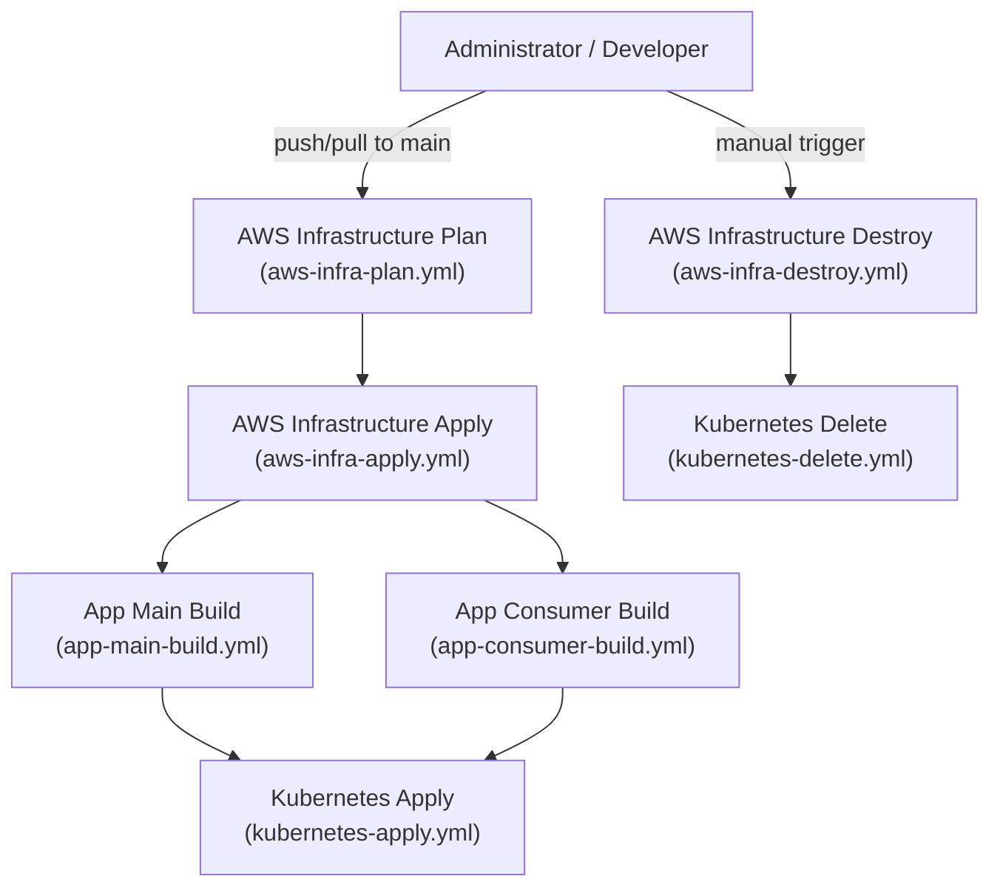
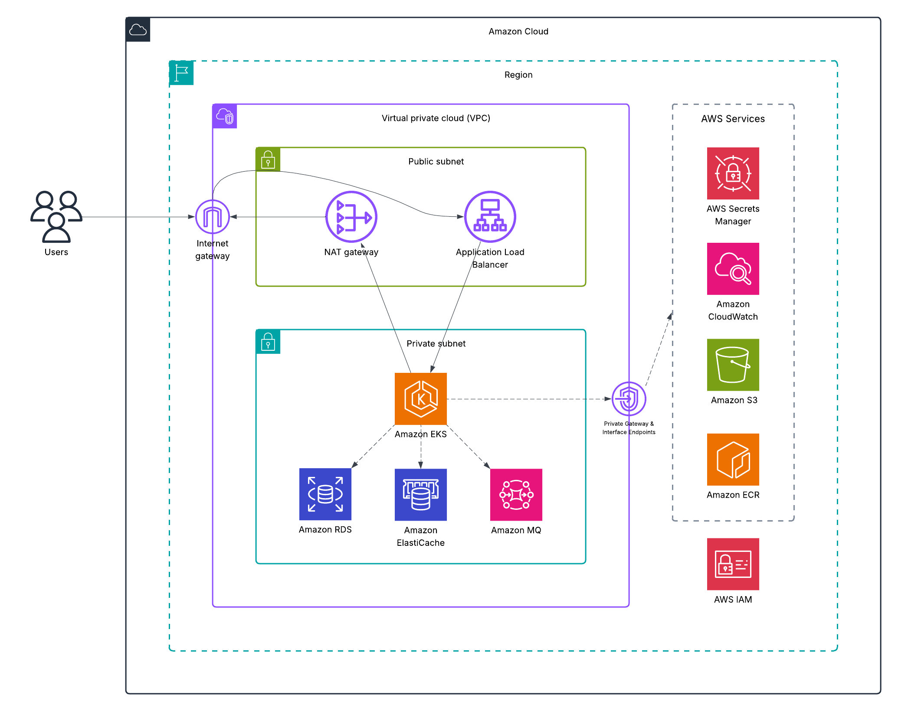
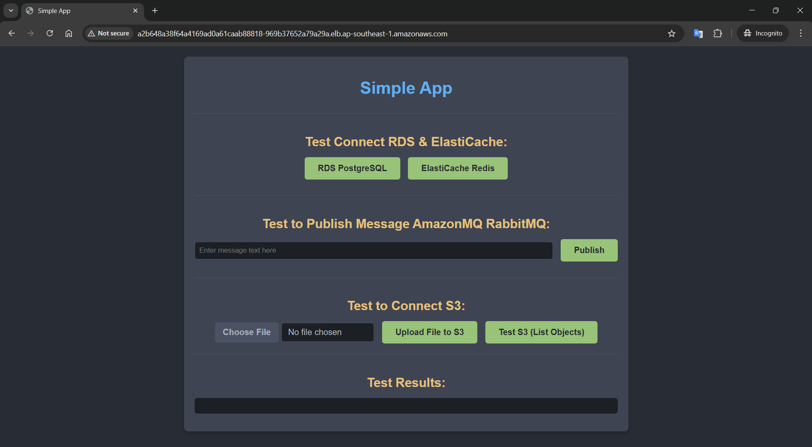

# Cloud IAC Demo

[](https://github.com/danielsidauruk/cloud-iac-demo/actions/workflows/aws-infra-plan.yml)
[](https://github.com/danielsidauruk/cloud-iac-demo/actions/workflows/aws-infra-apply.yml)
[](https://github.com/danielsidauruk/cloud-iac-demo/actions/workflows/app-main-build.yml)
[](https://github.com/danielsidauruk/cloud-iac-demo/actions/workflows/app-consumer-build.yml)
[](https://github.com/danielsidauruk/cloud-iac-demo/actions/workflows/kubernetes-apply.yml)
[](https://github.com/danielsidauruk/cloud-iac-demo/actions/workflows/aws-infra-destroy.yml)
[](https://github.com/danielsidauruk/cloud-iac-demo/actions/workflows/kubernetes-delete.yml)

This project demonstrates a complete CI/CD pipeline for a cloud-native application, using GitHub Actions, Terraform, and Kubernetes to automate deployment on AWS.

## Project Overview

This project showcases an automated approach to managing cloud infrastructure and application deployment using Infrastructure as Code (IaC). The infrastructure is provisioned with Terraform, providing a consistent and version-controlled environment.

The application consists of two services:

Main App: A public-facing web application for user interaction.
Consumer App: A background worker consuming messages from a RabbitMQ queue.

The key technologies used are:
*   **CI/CD:** GitHub Actions
*   **Infrastructure as Code:** Terraform
*   **Cloud Provider:** Amazon Web Services (AWS)
*   **Containerization:** Docker
*   **Container Orchestration:** Kubernetes (Amazon EKS)

## Project Structure

```
.
├── .github/workflows/   # GitHub Actions workflows
├── diagram/             # Architecture diagrams
├── src/
│   ├── app/             # Application source code
│   ├── aws/             # Terraform code for AWS infrastructure
│   └── kubernetes/      # Terraform code for Kubernetes resources
├── .gitignore
├── LICENSE
└── README.md
```

## Architecture

### High-Level Workflow

The diagram below illustrates the end-to-end workflow, from development to deployment.

<p align="center">
  
</p>

**Roles and Responsibilities:**
*   **Developer (Application):** Writes and maintains the application source code in `src/app`.
*   **Operations (Infrastructure):** Manages AWS infrastructure (`src/aws`), Kubernetes configurations (`src/kubernetes`), and CI/CD Pipeline of Github Workflows (`.github/workflows`)

### GitHub Workflow

The CI/CD pipeline is orchestrated using GitHub Actions. The workflow is triggered on pushes to the `main` branch and also includes manual triggers for destroying the infrastructure.



### AWS Infrastructure

The infrastructure is provisioned using Terraform, including a VPC, EKS cluster, and other resources.

<p align="center">
  
</p>

### Kubernetes Architecture

The application is deployed to an EKS cluster. The diagram below shows the Kubernetes resources, including deployments, services, and ingress.

<p align="center">
  
</p>

### Applications

#### Main App

The Main App is a Node.js application. It provides a simple web interface to test the integration with other AWS services.

<p align="center">
  
</p>

Features:
*   **Test RDS Connection:** Verifies the connection to the PostgreSQL database.
*   **Test ElastiCache Connection:** Verifies the connection to the Redis cluster.
*   **Publish RabbitMQ Message:** Publishes a message to a RabbitMQ exchange.
*   **Upload File to S3:** Uploads a file to an S3 bucket.
*   **List S3 Objects:** Lists the objects in an S3 bucket.

#### Consumer App

The Consumer App is a Node.js application that connects to a RabbitMQ queue, and consumes messages.


Example pod consuming the RabbitMQ channel:

```bash
kubernetes git(main): kubectl logs -f <app-consumer-pod-name> -n app
🔗 Attempting to connect to RabbitMQ at: rabbiqmq-endpoint-host.mq.ap-southeast-1.on.aws:5671
✅ Connected to RabbitMQ!
🛠️ Channel created.
💬 Exchange 'my_integration_exchange' asserted.
📦 Using queue 'my_terminal_consumer_queue'.
🤝 Queue 'my_terminal_consumer_queue' bound to exchange 'my_integration_exchange' with routing key 'integration.test'.
⏳ Waiting for messages in queue 'my_terminal_consumer_queue'. To stop, terminate the process (e.g., Ctrl+C).

✨ RECEIVED MESSAGE:
  • Content: "Test to publish Mesage MQ."
  • Timestamp: 2025-07-10T17:57:23.343Z

✨ RECEIVED MESSAGE:
  • Content: "Test to publish Mesage MQ. 02"
  • Timestamp: 2025-07-10T17:57:32.162Z
```

## Getting Started

Follow these instructions to get the project up and running in your own AWS account.

### Prerequisites

Ensure you have the following tools installed on your local machine:

*   [Terraform](https://www.terraform.io/downloads.html)
*   [AWS CLI](https://aws.amazon.com/cli/)
*   [kubectl](https://kubernetes.io/docs/tasks/tools/install-kubectl/)
*   [eksctl](https://eksctl.io/introduction/#installation)

You will also need:
*   An AWS account with the necessary permissions to create the resources defined in the Terraform code.
*   A GitHub repository to host the code and run the GitHub Actions.

### Configuration

1.  **Clone the repository:**
    ```bash
    git clone https://github.com/danielsidauruk/cloud-iac-demo.git
    cd cloud-iac-demo
    ```

2.  **Configure AWS Credentials:**
    Ensure your AWS credentials are configured correctly on the machine where you will be running Terraform, or set them up as secrets in your GitHub repository for the Actions to use.

3.  **Create or edit `terraform.tfvars`:**
    In the `src/aws` directory, create or adjust the file named `terraform.tfvars` and provide values for the variables defined in `variables.tf`.

    **Example `terraform.tfvars`:**
    ```hcl
    aws_region = "us-east-1"
    project_name = "app"
    # ... other variables
    ```

4.  **Update GitHub Actions & Preparing the Development Environment**
    Update the workflow files in `.github/workflows` to reference your GitHub repository and any specific settings you need. You will need to replace `danielsidauruk` in the badge URLs at the top of this README with your GitHub username.

    This project uses GitHub Environments to manage and secure deployments to the `dev` environment. This section outlines the necessary configurations within your GitHub repository's `dev` environment settings to enable automated deployments via GitHub Actions.

    The `dev` environment ensures that deployments are controlled, and sensitive credentials/configurations are securely managed.

    **Accessing the `dev` Environment Settings**
    1.  Navigate to your GitHub repository.
    2.  Click on `Settings` > `Environments` > `dev`.

    **1. Deployment Protection Rules**
    To ensure controlled and safe deployments to the `dev` environment, the following protection rules are configured:
    * **Required reviewers:** Specify teams or individuals who must approve workflow runs before deployments proceed.
    * **Wait timer:** An optional delay after approval before a deployment starts.
    * **Enable custom rules with GitHub Apps:** If you have custom deployment logic or external checks, these can be integrated here.
    * **Allow administrators to bypass configured protection rules:** Provides an override for repository administrators in emergency situations.

    **2. Environment Secrets**
    Sensitive data required by your GitHub Actions workflows for the `dev` environment must be stored as **Environment Secrets**. These are encrypted and not exposed in logs.

    | Secret Name           | Description                                                                                                                                      |
    | --------------------- | ------------------------------------------------------------------------------------------------------------------------------------------------ |
    | `AWS_ACCESS_KEY_ID`   | Your AWS Access Key ID, used for authenticating GitHub Actions with your AWS account to deploy resources.                                          |
    | `AWS_SECRET_ACCESS_KEY` | Your AWS Secret Access Key, corresponding to the above Access Key ID.                                                                            |
    | `GHP_TOKEN`           | A GitHub Personal Access Token (PAT) with appropriate scopes (e.g., `repo`, `workflow`) if your GitHub Actions need to interact with other parts of GitHub. |

    **3. Environment Variables**
    Non-sensitive configuration parameters specific to the `dev` environment are stored as **Environment Variables**.

    | Variable Name                 | Value                           | Description                                                                                             |
    | ----------------------------- | ------------------------------- | ------------------------------------------------------------------------------------------------------- |
    | `APPLICATION_NAME`            | `app`                           | The name of the application being deployed.                                                             |
    | `AWS_REGION`                  | `ap-southeast-1`                | The AWS region where resources for `dev` are deployed.                                                  |
    | `CONSUMER_REPOSITORY`         | `consumer`                      | The name for a consumer service/repository.                                                             |
    | `ENVIRONMENT_NAME`            | `dev`                           | Explicitly sets the environment name, useful for dynamic paths or naming conventions within Terraform.    |
    | `MAIN_REPOSITORY`             | `main`                          | Indicating the main branch for source code.                                                             |
    | `TF_AWS_BACKEND_KEY`          | `dev/eks/terraform.tfstate`     | The key for the Terraform state file within the S3 backend for AWS-related resources in `dev`.          |
    | `TF_BACKEND_BUCKET`           | `tfstate-app-bucket`            | The S3 bucket name used to store Terraform state files.                                                 |
    | `TF_BACKEND_REGION`           | `ap-southeast-1`                | The AWS region where the Terraform backend bucket is located.                                           |
    | `TF_KUBERNETES_BACKEND_KEY`   | `dev/kubernetes/terraform.tfstate` | The key for a separate Terraform state file for Kubernetes-specific resources within the S3 backend for `dev`. |

## Deployment

The CI/CD pipeline is configured to run automatically when changes are pushed to the `main` branch.

1.  **Push to `main`:**
    Commit and push your changes to the `main` branch.
    ```bash
    git push origin main
    ```

2.  **Monitor the Workflow:**
    Open your GitHub repository and navigate to the "Actions" tab to monitor the progress of the workflow. The pipeline will:
    *   Plan and apply the Terraform infrastructure.
    *   Build and push the Docker images for the `main` and `consumer` applications to ECR.
    *   Deploy the applications to the EKS cluster.

## Teardown

To avoid incurring ongoing costs, you can destroy the provisioned infrastructure.

1.  **Manual Workflow Trigger:**
    Navigate to the "Actions" tab in your GitHub repository.
2.  Select the "AWS Infrastructure Destroy" & "Kubernetes Delete" workflow.
3.  Run the workflow manually. This will trigger a `terraform destroy` command to remove all resources created by Terraform.

## Contributing

Contributions are welcome! Please feel free to submit a pull request or open an issue.

## License

This project is licensed under the terms of the MIT License. See the [LICENSE](LICENSE) file for details.