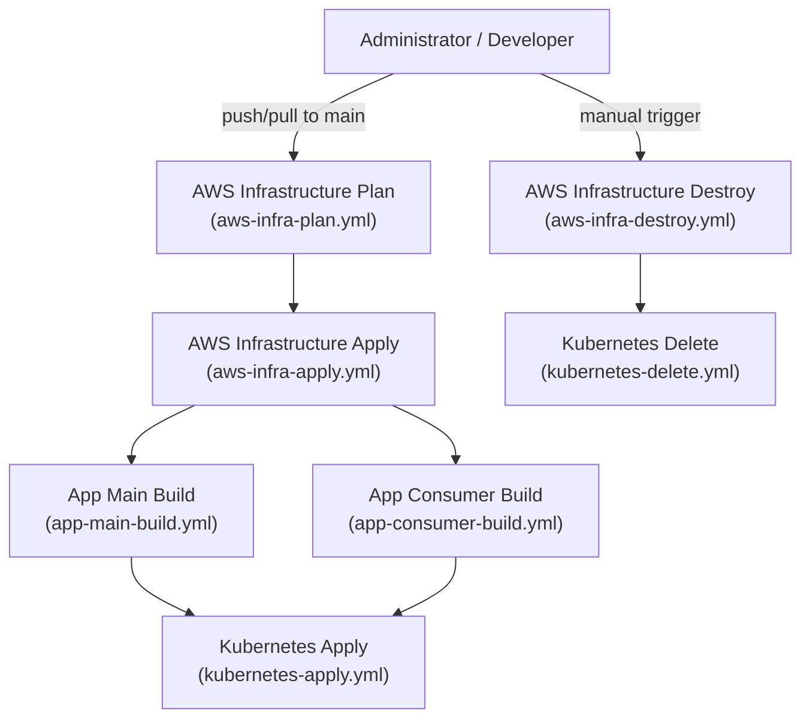

# Cloud IAC Demo

[](https://github.com/danielsidauruk/cloud-iac-demo/actions/workflows/aws-infra-plan.yml)
[](https://github.com/danielsidauruk/cloud-iac-demo/actions/workflows/aws-infra-apply.yml)
[](https://github.com/danielsidauruk/cloud-iac-demo/actions/workflows/app-main-build.yml)
[](https://github.com/danielsidauruk/cloud-iac-demo/actions/workflows/app-consumer-build.yml)
[](https://github.com/danielsidauruk/cloud-iac-demo/actions/workflows/kubernetes-apply.yml)
[](https://github.com/danielsidauruk/cloud-iac-demo/actions/workflows/aws-infra-destroy.yml)
[](https://github.com/danielsidauruk/cloud-iac-demo/actions/workflows/kubernetes-delete.yml)

This project demonstrates a complete CI/CD pipeline for a cloud-native application. It leverages GitHub Actions, Terraform, and Kubernetes to automate the entire process from code commit to deployment on AWS.

## Table of Contents

- [Project Overview](#project-overview)
- [Project Structure](#project-structure)
- [Architecture](#architecture)
  - [GitHub Workflow](#github-workflow)
  - [AWS Infrastructure](#aws-infrastructure)
  - [Kubernetes Architecture](#kubernetes-architecture)
  - [Applications](#applications)
    - [Main App](#main-app)
    - [Consumer App](#consumer-app)
- [Getting Started](#getting-started)
  - [Prerequisites](#prerequisites)
  - [Configuration](#configuration)
- [Deployment](#deployment)
- [Teardown](#teardown)
- [Contributing](#contributing)
- [License](#license)

## Project Overview

This project showcases a robust and automated approach to managing cloud infrastructure and application deployment using Infrastructure as Code (IaC). The entire infrastructure is defined and provisioned using Terraform, ensuring a consistent, repeatable, and version-controlled environment. This repository provides a practical demonstration of how to build, test, and deploy a containerized, two-tier application to a managed Kubernetes service on AWS, all orchestrated through a seamless CI/CD pipeline.

The application consists of two services:
*   **Main App:** A public-facing web application that serves as the primary user interface. It enables users to interact with various AWS services, including RDS, ElastiCache, S3, and ActiveMQ.
*   **Consumer App:** A background worker that processes messages from a RabbitMQ queue.

The key technologies used are:
*   **CI/CD:** GitHub Actions
*   **Infrastructure as Code:** Terraform
*   **Cloud Provider:** Amazon Web Services (AWS)
*   **Containerization:** Docker
*   **Container Orchestration:** Kubernetes (Amazon EKS)

## Project Structure

```
.
├── .github/workflows/         # GitHub Actions workflows
│   ├── app-consumer-build.yml
│   ├── app-main-build.yml
│   ├── aws-infra-apply.yml
│   ├── aws-infra-destroy.yml
│   ├── aws-infra-plan.yml
│   ├── complete-deployment.yml
│   ├── kubernetes-apply.yml
│   └── kubernetes-delete.yml
├── diagram/                   # Architecture diagrams
├── src/
│   ├── app/                   # Application source code
│   │   ├── consumer/          # Consumer service (consumer)
│   │   └── main/              # Main service (web app)
│   ├── aws/                   # Terraform code for AWS infrastructure
│   │   └── modules/           # Terraform modules for components segregation
│   └── kubernetes/            # Terraform code for Kubernetes resources
├── .gitignore
├── LICENSE
└── README.md
```

## Architecture

### GitHub Workflow

The CI/CD pipeline is orchestrated using GitHub Actions. The workflow is triggered on pushes to the `main` branch and also includes manual triggers for destroying the infrastructure.



### AWS Infrastructure

The AWS infrastructure is provisioned using Terraform. It creates a VPC with public and private subnets, an EKS cluster, and other necessary resources like ECR repositories, S3 buckets, and IAM roles.

<p align="center">
  
</p>

### Kubernetes Architecture

The application is deployed to an EKS cluster. The diagram below shows the Kubernetes resources, including deployments, services, and ingress.

<p align="center">
  
</p>

### Applications

#### Main App

The Main App is a Node.js application using the Express framework. It provides a simple web interface to test the integration with other AWS services.

<p align="center">
  
</p>

Features:
*   **Test RDS Connection:** Verifies the connection to the PostgreSQL database.
*   **Test ElastiCache Connection:** Verifies the connection to the Redis cluster.
*   **Publish RabbitMQ Message:** Publishes a message to a RabbitMQ exchange.
*   **Upload File to S3:** Uploads a file to an S3 bucket.
*   **List S3 Objects:** Lists the objects in an S3 bucket.

#### Consumer App

The Consumer App is a Node.js application that connects to a RabbitMQ queue, and consumes messages.


Example pod consuming the RabbitMQ channel:

```bash
kubernetes git(main): kubectl logs -f <app-consumer-pod-name> -n app
🔗 Attempting to connect to RabbitMQ at: rabbiqmq-endpoint-host.mq.ap-southeast-1.on.aws:5671
✅ Connected to RabbitMQ!
🛠️ Channel created.
💬 Exchange 'my_integration_exchange' asserted.
📦 Using queue 'my_terminal_consumer_queue'.
🤝 Queue 'my_terminal_consumer_queue' bound to exchange 'my_integration_exchange' with routing key 'integration.test'.
⏳ Waiting for messages in queue 'my_terminal_consumer_queue'. To stop, terminate the process (e.g., Ctrl+C).

✨ RECEIVED MESSAGE:
  • Content: "Test to publish Mesage MQ."
  • Timestamp: 2025-07-10T17:57:23.343Z

✨ RECEIVED MESSAGE:
  • Content: "Test to publish Mesage MQ. 02"
  • Timestamp: 2025-07-10T17:57:32.162Z
```

## Getting Started

Follow these instructions to get the project up and running in your own AWS account.

### Prerequisites

Ensure you have the following tools installed on your local machine:

*   [Terraform](https://www.terraform.io/downloads.html)
*   [AWS CLI](https://aws.amazon.com/cli/)
*   [kubectl](https://kubernetes.io/docs/tasks/tools/install-kubectl/)
*   [eksctl](https://eksctl.io/introduction/#installation)

You will also need:
*   An AWS account with the necessary permissions to create the resources defined in the Terraform code.
*   A GitHub repository to host the code and run the GitHub Actions.

### Configuration

1.  **Clone the repository:**
    ```bash
    git clone https://github.com/danielsidauruk/cloud-iac-demo.git
    cd cloud-iac-demo
    ```

2.  **Configure AWS Credentials:**
    Ensure your AWS credentials are configured correctly on the machine where you will be running Terraform, or set them up as secrets in your GitHub repository for the Actions to use.

3.  **Create or edit `terraform.tfvars`:**
    In the `src/aws` directory, create or adjust the file named `terraform.tfvars` and provide values for the variables defined in `variables.tf`.

    **Example `terraform.tfvars`:**
    ```hcl
    aws_region = "us-east-1"
    project_name = "app"
    # ... other variables
    ```

4.  **Update GitHub Actions:**
    Update the workflow files in `.github/workflows` to reference your GitHub repository and any specific settings you need. You will need to replace `danielsidauruk` in the badge URLs at the top of this README with your GitHub username.

## Deployment

The CI/CD pipeline is configured to run automatically when changes are pushed to the `main` branch.

1.  **Push to `main`:**
    Commit and push your changes to the `main` branch.
    ```bash
    git push origin main
    ```

2.  **Monitor the Workflow:**
    Open your GitHub repository and navigate to the "Actions" tab to monitor the progress of the workflow. The pipeline will:
    *   Plan and apply the Terraform infrastructure.
    *   Build and push the Docker images for the `main` and `consumer` applications to ECR.
    *   Deploy the applications to the EKS cluster.

## Teardown

To avoid incurring ongoing costs, you can destroy the provisioned infrastructure.

1.  **Manual Workflow Trigger:**
    Navigate to the "Actions" tab in your GitHub repository.
2.  Select the "AWS Infrastructure Destroy" & "Kubernetes Delete" workflow.
3.  Run the workflow manually. This will trigger a `terraform destroy` command to remove all resources created by Terraform.

## Contributing

Contributions are welcome! Please feel free to submit a pull request or open an issue.

## License

This project is licensed under the terms of the MIT License. See the [LICENSE](LICENSE) file for details.